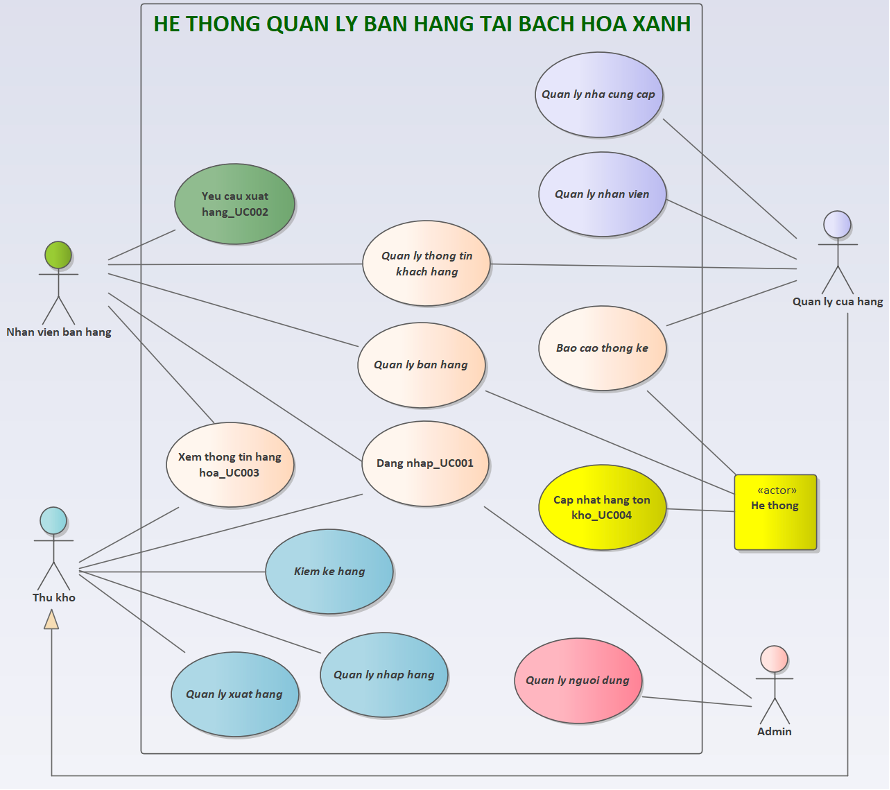
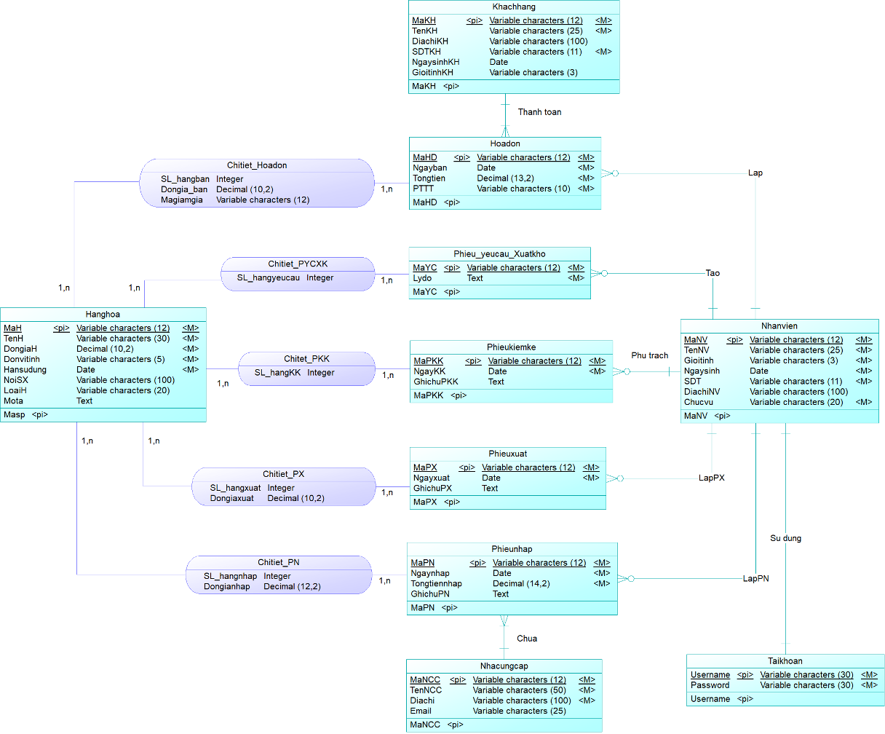
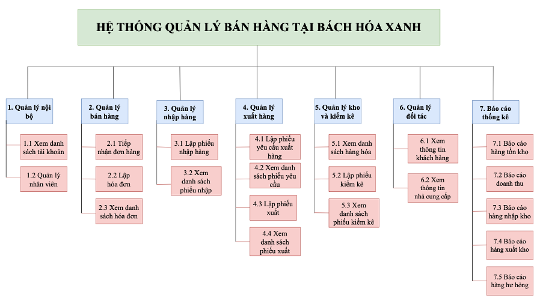
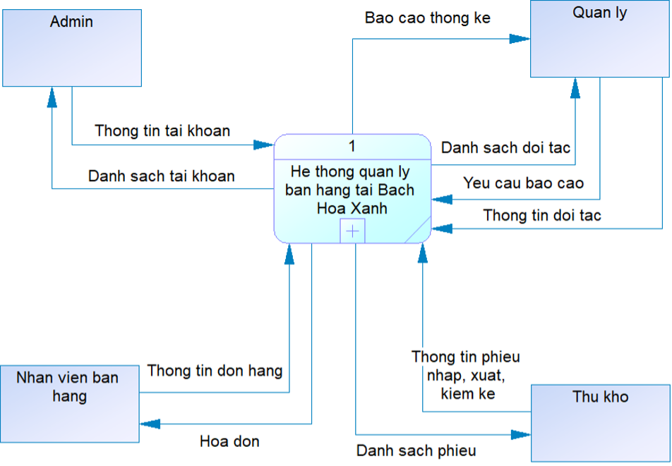
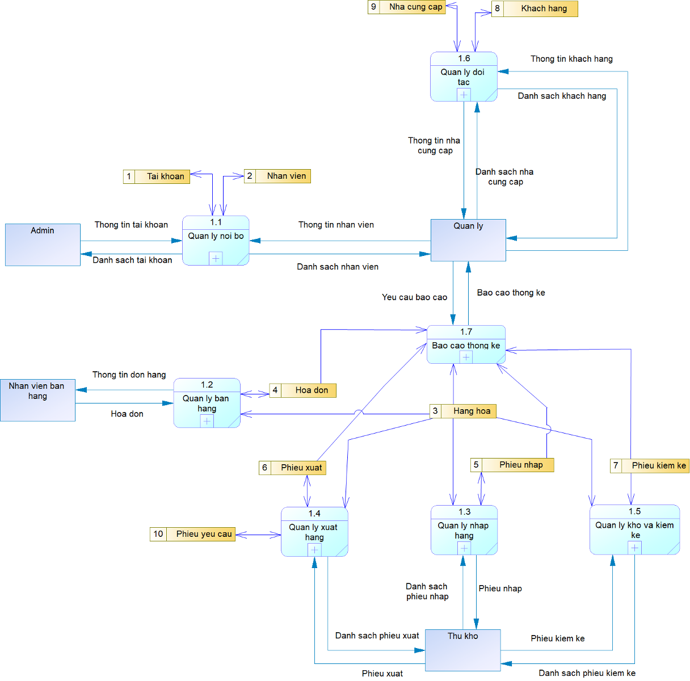
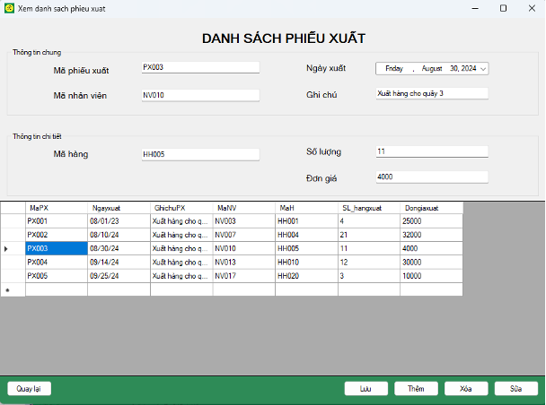
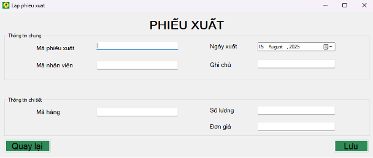

# Project-System-Analysis-and-Design

## Giới thiệu
Dự án được thực hiện nhằm phân tích và thiết kế Hệ thống thông tin quản lý bán hàng cho Bách Hóa Xanh.

Nội dung tập trung vào khảo sát nghiệp vụ, xác định yêu cầu hệ thống, mô hình hóa quy trình hoạt động và thiết kế cơ sở dữ liệu nhằm đề xuất giải pháp quản lý phù hợp cho doanh nghiệp.

## Mục tiêu dự án

- Khảo sát và phân tích quy trình quản lý bán hàng hiện tại  
- Xác định yêu cầu chức năng và phi chức năng của hệ thống  
- Thiết kế mô hình nghiệp vụ và luồng xử lý dữ liệu  
- Xây dựng mô hình cơ sở dữ liệu phục vụ quản lý  
- Đề xuất giải pháp hỗ trợ quản lý và vận hành hiệu quả  

## Phạm vi chức năng

- Quản lý tài khoản và phân quyền  
- Quản lý hàng hóa  
- Quản lý hóa đơn bán hàng  
- Quản lý nhập – xuất – tồn kho  
- Quản lý khách hàng  
- Quản lý nhà cung cấp  
- Quản lý chứng từ và báo cáo  

## Thiết kế hệ thống
### Sơ đồ Use Case

### Thiết kế cơ sở dữ liệu (ERD)

### Mô hình phân rã chức năng

### Mô hình DFD Mức 0

### Mô hình DFD Mức 1

## Giao diện minh họa của dự án
### Quản lý phiếu xuất

### Lập phiếu xuất

